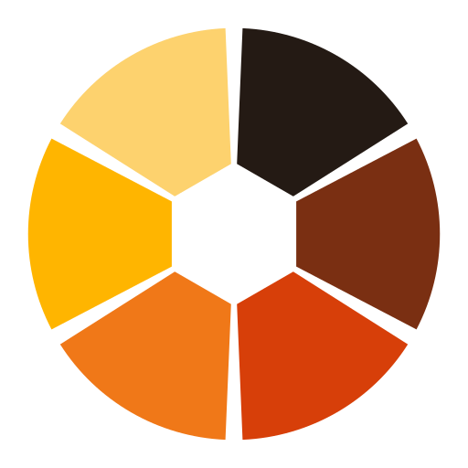

<p align="center">
  <picture>
    <source media="(prefers-color-scheme: dark)" srcset="public/logo/a-exposure-stack-dark.svg" />
    
  </picture>
</p>

<h1 align="center">HDRI Calibration Tool</h1>

<p align="center"><em>Calibrated luminance maps from a bracketed set of photographs, in your browser or on your desktop.</em></p>

<p align="center">
<a href="./LICENSE"></a>
<a href="https://www.clotildepierson.com/software"></a>
<a href="https://webassembly.org/"></a>
<a href="https://tauri.app/"></a>
<a href="https://nextjs.org/"></a>
<a href="https://tailwindcss.com/"></a>
</p>

This application provides a graphical user interface for the creation and calibration of High Dynamic Range (HDR) images. It runs Radiance, `hdrgen` and `dcraw_emu` internally, as WebAssembly, so none of them has to be installed. It follows the pipeline process published [here](https://www.tandfonline.com/doi/full/10.1080/15502724.2019.1684319). The program works by taking in multiple LDR image files as well as some calibration information related to the camera/lens used, in order to return calibrated HDR images, also called luminance maps. The application is intended for lighting and daylighting professionals or researchers who are interested in studying the indoor visual environment and especially discomfort glare.

## One application, two ways to run it

**This is a web app and a desktop app, built from a single codebase.** There is
one frontend, one pipeline, and one set of image-processing tools. Nothing is
reimplemented per platform.

|  | Desktop | Browser |
|---|---|---|
| How you get it | Installer from [Releases](https://github.com/radiantlab/HDRICalibrationTool/releases/latest) | Open the URL. Nothing to install. |
| Shell | Tauri 2 (a native window around the same pages) | The tab you opened |
| Image pipeline | Identical WebAssembly, in a Web Worker | Identical WebAssembly, in a Web Worker |
| Where images go | Written to the output folder you choose | Downloaded; the browser picks the folder |
| Reopening earlier inputs | Yes, they are real paths | No; a browser gives no durable handle to a picked file |
| Reveal in file manager | Yes | Not offered, as there is nothing to reveal |

**Your images never leave your machine in either case.** The web build is a
static export with no server, no API and no upload. Every pixel is processed by
WebAssembly running inside the page, which is the same code the desktop app
runs. Hosting it costs nothing but a static file server, and closing the tab
takes the data with it.

The differences above are the honest ones, and all of them come from what a
browser is allowed to do rather than from anything left unfinished. They live
behind `src/lib/host/`, which is the only place either build knows which one it
is; see [DEPLOYMENT.md](./DEPLOYMENT.md) for the web build's limits in detail.

## Supported Platforms

- Windows
- macOS (Intel and Apple Silicon)
- Ubuntu
- **Any modern browser**, including Safari. See [DEPLOYMENT.md](./DEPLOYMENT.md).

## Getting Started

**In a browser**, open the deployed site. There is nothing to install and
nothing to configure; skip to [Use](#use).

**On the desktop**, install the [HDRI Calibration Interface](https://github.com/radiantlab/HDRICalibrationTool/releases/latest) for your operating system. That is the whole of it.

**There is nothing else to install and no paths to configure.** Radiance, `hdrgen` and `dcraw_emu` all ship inside the application, compiled to WebAssembly, and run there. Earlier versions required you to install Radiance and `hdrgen` yourself and tell the app where they were; that step is gone. The Settings page reports which version of each is in use.

macOS builds are signed and notarized. Windows and Linux builds are unsigned and may be flagged as untrusted; on Windows, choose "More info" then "Run anyway".

The **HDR image viewer** is built into the application and runs on every supported platform with no additional software. Earlier versions opened images through Radiance's X11-based `ximage`, which is why XQuartz used to be required on macOS and why the viewer was unavailable on Windows; neither applies now.

## Use

### Uploading Images

Open the application created by the installer in the previous step. You should be able to see the main page of the program. Next you will need to upload the images in the image selection section by clicking the select button. Optionally, you can select a folder that contains the images you will be uploading. The filetypes supported are JPG, TIF, and raw image formats. After uploading the images, you should see a list of the images and the image count should reflect the number of uploaded images.

### Uploading Response File and Image Information

Upload the response file that should have a file extension of `.rsp` and fill in the image data for the cropping, resizing and view settings. Check the `example` directory for more information.

### Uploading Calibration Files

Upload the calibration files for the remaining fields. These should have a `.cal` file extension. Check the `example` directory for more information.

### Settings

Click on the settings tab in the left hand navigation sidebar. The only path to set is the output folder, where generated images are saved. The page also reports the versions of the app and of the image-processing tools built into it.

### Generate Images

Once settings are entered, you can close the settings and click the Generate HDR Image button in the navigation sidebar. A message will let you know about the process or give you an error if something is wrong.

### Viewing HDR Images

Open the image viewer from the left hand navigation sidebar and drop an `.hdr` file on it. Any Radiance picture works, whether or not this application produced it.

The viewer renders the picture itself or a false-color luminance map, and reads the header for the values the pipeline recorded, including `COMPUTED_VERTICAL_ILLUMINANCE` (the vertical illuminance `evalglare` derived) and `MEASURED_VERTICAL_ILLUMINANCE` (the reference value you supplied, if any).

Hovering reports the luminance under the cursor. Shift+click and drag selects a region and reports its average, median, minimum, maximum and distribution. On a fisheye picture (one whose header records a `-vta` or `-vth` view), the corners of the square crop fall outside the lens circle and never saw the scene, so they are excluded from those statistics; the panel says so when it applies. Non-fisheye pictures fill their frame, so every pixel is counted.

## Additional Resources

For further guidance about creating and calibrating HDR images, please consult [Tutorial: Luminance Maps for Daylighting Studies from High Dynamic Range Photography](https://www.tandfonline.com/doi/full/10.1080/15502724.2019.1684319) by Clotilde Pierson, Coralie Cauwerts, Magali Bodart, and Jan Wienold.

## Contributing

This project leverages [Tauri](https://tauri.app/) with [Rust](https://www.rust-lang.org/) and the following frameworks:

- [Next.js](https://nextjs.org/)
- [Tailwind CSS](https://tailwindcss.com/docs/guides/nextjs)

The image-processing tools are built from forks we maintain and committed as
WebAssembly in `public/wasm/`. Rebuilding them is only necessary when bumping
one of these; see [`public/wasm/README.md`](./public/wasm/README.md).

- [radiantlab/Radiance](https://github.com/radiantlab/Radiance) — fork of [LBNL-ETA/Radiance](https://github.com/LBNL-ETA/Radiance)
- [radiantlab/hdrgen](https://github.com/radiantlab/hdrgen) — fork of [radiance-org/hdrgen](https://github.com/radiance-org/hdrgen)
- [radiantlab/LibRaw](https://github.com/radiantlab/LibRaw) (`dcraw_emu`) — fork of [LibRaw/LibRaw](https://github.com/LibRaw/LibRaw)

Contributions are currently limited to those working on the Architectural Lighting Design Capstone Project at Oregon State University. If you are interested in contributing, please contact the project authors.

### Guidelines

1. Create a new issue in the GitHub repository to discuss your feature or bug fix.
2. Fork the repository.
3. Create a new branch for your feature or fix. The branch name should start with the issue number, e.g., `123-feature-name`.
4. Make your changes and commit them with a clear message.
5. Push your changes to your forked repository.
6. Create a pull request against the main repository's `main` branch.

Every PR must be reviewed by at least one team member and successfully build. Once changes have been approved and merged, feature branches should be deleted. We recommend only having one branch open at a time to keep the workflow clean (per contributor).

### Development

In order to create a working environment, first clone the repository, and `cd` into `HDRICalibrationTool`.

Make sure you have the latest [Node.js](https://nodejs.org/en) and [Rust](https://www.rust-lang.org/) installed.

To install dependiencies, run:

```sh
npm install
```

You can also use `pnpm`, `bun`, or `yarn` as alternatives.

Run the development server with:

```sh
npm run tauri dev
```

To work on the web build alone, `npm run dev` is enough. There is no Rust to compile and no Tauri to launch, because the browser build is the same static export.

### Testing

```sh
npm test              # unit tests (Jest)
npm run check         # lint and format (Biome, via ultracite)
npm run test:e2e:web      # builds ./out, then drives it in WebKit and Chromium
npm run test:e2e:desktop  # builds the Tauri app, then drives it in its own webview
```

There are two end-to-end suites because there have to be. Playwright cannot attach to a Tauri window: neither WKWebView nor WebKitGTK exposes a CDP endpoint for it to speak to. So [`e2e-web/`](./e2e-web) drives the browser build with Playwright and [`e2e-tests/`](./e2e-tests) drives the desktop build with WebdriverIO. They cover paths that genuinely differ — file dialogs versus dropped paths, downloads versus writes to a chosen folder — and they share the same input fixtures so they cannot drift apart while both stay green.

The web suite runs **WebKit first**, deliberately. Safari implements no part of the File System Access API, so it takes the plain file-input and download path, which is what the application actually ships to everyone.

### Continuous integration

| Workflow | Trigger | What it does |
|---|---|---|
| [`ci-web.yml`](./.github/workflows/ci-web.yml) | every push and PR | Lint, types, unit tests, the static export, and the Playwright suite in WebKit and Chromium |
| [`ci-desktop.yml`](./.github/workflows/ci-desktop.yml) | every push and PR | `cargo fmt`/`clippy`, a Tauri build on macOS, Ubuntu and Windows, and the WebdriverIO suite |
| [`release.yml`](./.github/workflows/release.yml) | manual only | Builds installers for all three platforms, signs and notarizes the macOS one, and attaches them to a release |

Neither CI workflow installs Radiance or hdrgen, because there is nothing to install. That is also why the end-to-end case that actually generates an HDR image now runs on every push; it previously could not run in CI at all.

### Build

For the `tauri build` command to get the arguments, you need to prepend an extra `--`, such as:

```sh
npm run tauri build -- --target universal-apple-darwin
```

To build the web app, `npm run build` writes a static site to `./out`. See [DEPLOYMENT.md](./DEPLOYMENT.md).

### Releasing

Run the **Release** workflow from the Actions tab. It builds all three platforms, publishes only if every one of them succeeded, and leaves the result as a draft unless you ask otherwise. Bump the version in `package.json`, `src-tauri/tauri.conf.json` and `src-tauri/Cargo.toml` together first; the workflow checks that the three agree and refuses to build if they do not.

## Acknowledgements & Licensing

This app builds upon the scene processing and simulation strengths of existing programs such as Radiance, `hdrgen`, and LibRaw. All three are compiled to WebAssembly from the forks listed below and shipped with the application, so it has no external dependencies.

The application itself is licensed **GPL-3.0** (see [`LICENSE`](./LICENSE)). It incorporates:

| Component | Licence | Source |
|---|---|---|
| Radiance tools | Radiance Software License 2.0 (BSD-3-Clause in substance) | [radiantlab/Radiance](https://github.com/radiantlab/Radiance) |
| `hdrgen` | BSD-3-Clause, see [`licenses/BSD-3-Clause.txt`](./licenses/BSD-3-Clause.txt) | [radiantlab/hdrgen](https://github.com/radiantlab/hdrgen), upstream at [radiance-org/hdrgen](https://github.com/radiance-org/hdrgen) |
| panlib | BSD-3-Clause | [radiantlab/panlib](https://github.com/radiantlab/panlib) |
| LibRaw (`dcraw_emu`) | LGPL-2.1, see [`licenses/LGPL-2.1.txt`](./licenses/LGPL-2.1.txt) | [radiantlab/LibRaw](https://github.com/radiantlab/LibRaw), upstream at https://www.libraw.org/ |

LibRaw offers a choice of LGPL-2.1 or CDDL-1.0; the LGPL is the one that applies here, because the CDDL is incompatible with the GPL. Where LibRaw is statically linked rather than invoked as a separate process, as it is in the WebAssembly pipeline, it is incorporated under **LGPL-2.1 section 3**, which permits applying ordinary GPL terms to that copy. The reasoning, and the obligations that follow for a browser deployment, are recorded in [`licenses/DECISIONS.md`](./licenses/DECISIONS.md).

### Authors

- Dr. Clotilde Pierson (Oregon State University)
- Alex Ulbrich (Oregon State University)

Contact: [alexander.ulbrich@oregonstate.edu](mailto:alexander.ulbrich@oregonstate.edu)

### Contributors

#### 2022-2023

- Xiangyu “Joey” Li
- Liam Zimmermann
- Nathaniel Klump

#### 2023-2024

- Jacob Springer
- Shanti Morrell

#### 2024-2025

- Emmitt Carter
- Samuel Croll
- Colin Cone
- Artin Lahni
- Madison Thompson
- Lou Pfluke

#### 2025-2026

- Thomas Eaton
- Joel Fief
