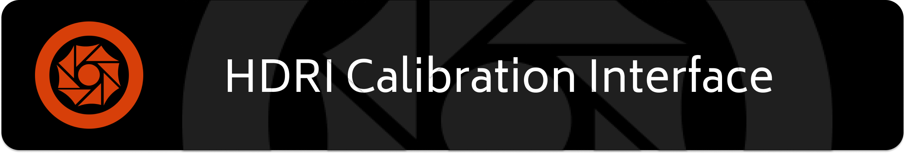

# For Developers

## Dependencies
This project uses [Tauri](https://tauri.app/) which depends on [Next.js](https://nextjs.org/) (no installation needed) for the frontend, [Rust](https://www.rust-lang.org/) for the backend and [Tailwind CSS](https://tailwindcss.com/docs/guides/nextjs) (no installation needed) for styling. Next.js and Tailwind CSS depend on the installation of [nodejs](https://nodejs.org/en).

## Installation
In order to create a working environment, first clone the repository and cd into `HDRICalibrationTool-Capstone`.

Run `npm install` and wait for dependencies to install.

Run `npm run tauri dev`. This will install the Tauri dependencies and launch the application once complete.

## File Structure
Forntend: `src/app/(component)` every component of the application is split into its own file (settings, input images, cropping resizing...) which are then used by `page.tsx` and handled by `layout.tsx`. Each file in the front end has the same structure (function declaration, parameters, display states, function states, functions and HTML)

Backend: `src-tauri` contains the `tauri.conf.json` file which handles app title, app size, list of api functions and other configuration settings. `src-tauri/src/pipeline.rs` contains the main functionality for HDRGen.

## Contribution
Contribution to the repo is limited to those working on the Architectural Lighting Design Capstone Project.
